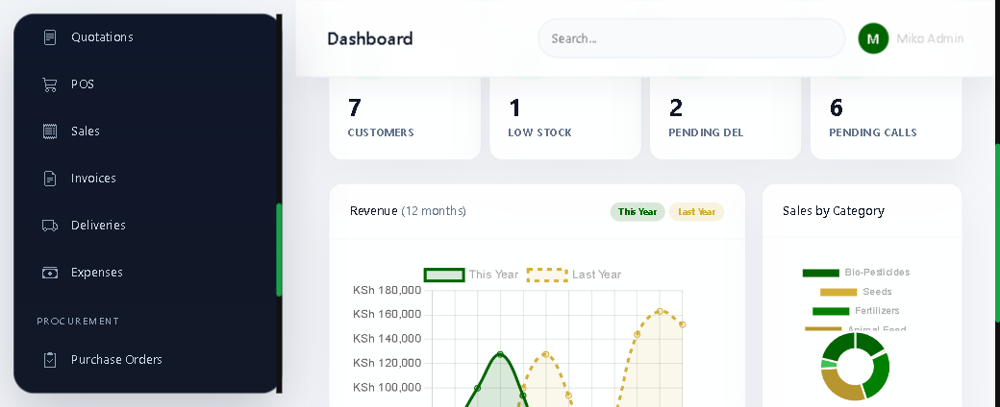
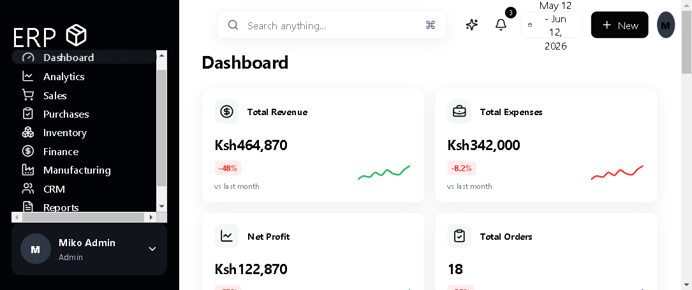

# FarmTrack ERP (erpftc)

A full-featured Enterprise Resource Planning system for agricultural businesses, built with React and Vite, hosted on Vercel, and using Cloudflare D1 for structured data and Cloudflare R2 for files. Supabase is retired and must not be used as a runtime dependency or data source. Production releases are managed through a separate repair branch until smoke and regression checks pass. Deployed on Vercel at **[erpftc.vercel.app](https://erpftc.vercel.app)**.

## Dashboard Preview

Here’s how the main dashboard looks:





## Features

### Core Modules
- **Dashboard** — Executive command center with KPIs, revenue charts, attention alerts, and AI-powered recommendations
- **Analytics** — Advanced analytics with 9 intelligence tabs (revenue, sales, inventory, production, procurement, customer, financial, AI, forecasting)
- **Sales** — Full sales pipeline, quotes, orders, invoices, team performance, territory coverage, field visits, CSV import
- **Purchases** — Purchase requests, POs, supplier scorecards, deliveries, goods receiving, credit purchases, payables
- **Inventory** — 25+ tabs including stock control, warehouses, movements, adjustments, transfers, audits, expiry tracking, barcode/QR scanning, stock valuation (FIFO/LIFO/Weighted Average), batch & lot tracking, reorder rules, cycle counts, supplier links, stock reservations, cost analysis, ABC classification, dead stock, and manufacturing integration
- **Finance** — Full posted backend with journals, ledger, chart of accounts, receivables, payables, banking, cash management, expenses, revenue, payroll, taxes, fixed assets, budgeting, reconciliation, cost centers, forecasting, and AI insights
- **Accounts** — Chart of accounts, receivables, payables, bank transactions, trial balance, journals, reconciliation, quotations, customer statements, expenses, audit trail, and financial reports
- **Manufacturing** — Versioned BOMs (formulas), raw material management with UOM conversion, production orders with material validation, batch traceability, quality control, waste tracking, cost breakdown, capacity planning, OEE metrics, and production calendar
- **CRM** — Customer directory, pipeline kanban, leads, call logging, activities, reports, and customer intelligence with churn prediction and CLV
- **HR** — Employee directory, departments (add/edit/delete), attendance with clock in/out, performance reviews, recruitment pipeline, payroll with hourly/salary support, payslips, and HR reports
- **Leaves** — Leave application, approval workflow, balance tracking, and team calendar
- **Requisitions** — Cross-module requisition system with approval workflow, PDF generation, and email notifications
- **Email** — Compose, drafts, sent tracking, and 15+ email templates
- **Email Admin** — Delivery monitoring, module breakdown, retry failed emails, and engagement tracking
- **Notifications** — Real-time alert center with AI briefings, priority filtering, and category tabs
- **Reports** — Executive dashboard, department-specific reports, custom dashboard builder, and 6 export formats (PDF, Excel, CSV, PowerPoint, Print, Email Package)
- **Settings** — 26 configuration tabs including company profile, email integration, users, permissions, departments, warehouses, products, tax, automation, integrations, Supabase, and security

### AI Assistant
- Natural conversation style with 2-paragraph responses
- No emojis, clean markdown rendering
- Context-aware with live ERP data
- Suggested actions and navigation
- Streaming responses
- Feedback (like/dislike) system

## Tech Stack

| Layer | Technology |
|-------|-----------|
| Frontend | React 18, Vite 6, Recharts, Lucide Icons |
| Backend | Vercel Serverless Functions (Node.js) |
| Database | Cloudflare D1 |
| Email | Resend |
| Exports | ExcelJS, PDFKit, PptxGenJS |
| AI | Gemini / OpenRouter (multi-model fallback) |
| File storage | Cloudflare R2 |
| Cache / ephemeral configuration | Cloudflare KV (optional) |
| Hosting | Vercel |
| Domain | staff.farmtrack.co.ke |

## Getting Started

### Prerequisites
- Node.js 18+
- npm or pnpm

### Installation

```bash
cd my-big-project-ERP--main
npm install
npm run dev
```

### Build

```bash
npm run build
```

### Deploy

```bash
vercel --prod
```

## Environment Variables

| Variable | Description |
|----------|-------------|
| `CLOUDFLARE_ACCOUNT_ID` | Cloudflare account ID |
| `CLOUDFLARE_D1_DATABASE_ID` | Cloudflare D1 database ID |
| `CLOUDFLARE_API_TOKEN` | Scoped Cloudflare API token for D1 operations |
| `R2_ACCOUNT_ID` | Cloudflare account ID for R2 (or `CLOUDFLARE_ACCOUNT_ID`) |
| `R2_ACCESS_KEY_ID` | R2 S3-compatible access key ID |
| `R2_SECRET_ACCESS_KEY` | R2 S3-compatible secret access key |
| `R2_BUCKET_NAME` | Existing Cloudflare R2 bucket name |
| `R2_PUBLIC_BASE` | Optional public/custom domain base URL for files |
| `RESEND_API_KEY` | Resend email API key |
| `GEMINI_API_KEY` | Google Gemini API key (optional) |
| `OPENROUTER_API_KEY` | OpenRouter API key (optional, AI fallback) |

## Project Structure

```
my-big-project-ERP--main/
├── api/                    # Serverless API routes
│   ├── rpc.js              # Main RPC handler (10,000+ lines)
│   ├── ai-assistant.js     # AI assistant with natural responses
│   ├── email-track.js      # Email tracking
│   ├── resend-service-core.js  # Email service
│   └── ...
├── src/
│   ├── main.jsx            # Main app (9,000+ lines, all modules)
│   ├── styles.css          # Global styles
│   ├── components/
│   │   ├── AIAssistant/    # AI chat assistant
│   │   ├── HR/             # HR modals, payslips, departments
│   │   ├── Manufacturing/  # BOM, raw materials, production
│   │   └── Reports/        # Executive dashboard charts
│   └── hooks/              # Custom React hooks
├── data/                   # Seed data
├── sql-migrations/         # Database migrations
├── public/                 # Static assets
├── vercel.json             # Vercel deployment config
└── vite.config.js          # Vite build config
```

## License

See [LICENSE](LICENSE) file for details.

## Live Demo

Visit **[erpftc.vercel.app](https://erpftc.vercel.app)**

Demo credentials: `miko@gmail.com` / `1234567890`
